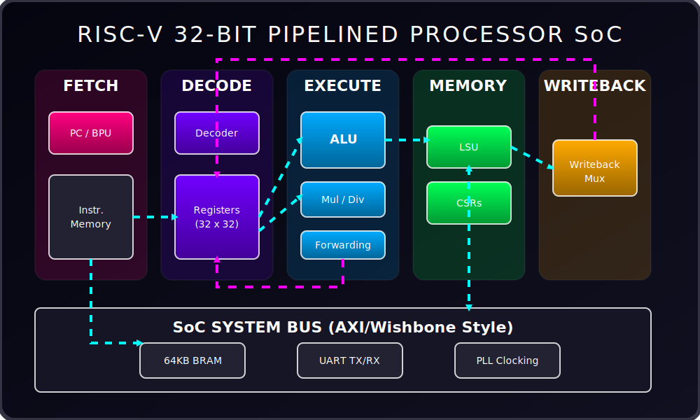

<div align="center">
  
</div>

<div align="center">
  <a href="#"></a>
  <a href="#"></a>
  <a href="#"></a>
  <a href="#"></a>
  <a href="#"></a>
</div>

<br>

<div align="center">
  
  <br>
  <i>(Animated High-Level Pipeline & SoC Bus Architecture)</i>
</div>

<br>

## 🌌 Project Overview
Welcome to the ultimate custom **RISC-V CPU & SoC** project! This repository contains a fully working, formally verified 5-stage pipelined RV32IM processor written from scratch in SystemVerilog, explicitly tailored for FPGA deployment.

The processor comes integrated into a custom System-on-Chip (SoC) environment complete with memory-mapped BRAM, a custom UART peripheral, and bare-metal firmware running a fully playable **Snake Game** directly on the FPGA via a serial terminal!

---

## ✨ Dynamic Features

<details open>
<summary><b><span style="font-size: 1.2em">🔥 High-Performance Core Pipeline</span></b></summary>
<br>
<ul>
  <li><b>5-Stage Pipeline:</b> Classic Instruction Fetch, Decode, Execute, Memory, and Writeback stages designed for minimal structural hazards.</li>
  <li><b>Data Forwarding & Hazard Handling:</b> Fully transparent bypassed data paths for 1-cycle latency without stalling on dependent instructions.</li>
  <li><b>Hardware Math:</b> Custom <code>M</code> extension support with a dedicated Multiplier and Divider unit running concurrently with the ALU.</li>
  <li><b>Synchronous Memory Ready:</b> Precisely timed for 1-cycle latency Block RAMs without penalizing CPI.</li>
</ul>
</details>

<details open>
<summary><b><span style="font-size: 1.2em">🛡️ Formally Verified (Mathematical Proofs)</span></b></summary>
<br>
<ul>
  <li>Verified using <b>SymbiYosys (SBY)</b> with the Boolector and Yices2 solvers.</li>
  <li>Mathematical assertion properties prove that the control logic, CSR registers, and hazard mitigations are fundamentally flawless and mathematically impossible to break under normal operating bounds.</li>
</ul>
</details>

<details open>
<summary><b><span style="font-size: 1.2em">🎮 SoC & FPGA Integration</span></b></summary>
<br>
<ul>
  <li><b>Custom Peripherals:</b> Memory-mapped UART TX/RX with 2-stage metastability synchronizers.</li>
  <li><b>Synthesizable Memory:</b> Synchronous 64KB Block RAM (BRAM) inferred perfectly for Xilinx 7-Series FPGAs.</li>
  <li><b>Firmware Stack:</b> Custom GCC <code>Makefile</code>, bare-metal C runtime (<code>startup.S</code>), linker scripts, and polling-based hardware drivers.</li>
  <li><b>Fully Playable Demo:</b> A pure C ANSI-escape sequence snake game that runs over serial terminal at 115200 baud!</li>
</ul>
</details>

---

## 🛠️ Tools & Technologies

<div align="center">
  <table>
    <tr>
      <td align="center"><b>Hardware Description</b></td>
      <td align="center"><b>Verification & Simulation</b></td>
      <td align="center"><b>Synthesis & Deployment</b></td>
      <td align="center"><b>Firmware Development</b></td>
    </tr>
    <tr>
      <td align="center"></td>
      <td align="center">
        <br>
        <br>
        
      </td>
      <td align="center">
        <br>
        
      </td>
      <td align="center">
        <br>
        
      </td>
    </tr>
  </table>
</div>

---

## 🚀 How to Run (Arty S7-50 Deployment)

Follow these steps to deploy the SoC to your FPGA and play the game:

### 1️⃣ Compile the Firmware
You need the RISC-V GCC toolchain (`riscv-none-elf-gcc`).
```bash
cd phase8/software
make CROSS=riscv-none-elf program
```
<i>This compiles `snake.c`, links it via `link.ld`, and generates `firmware.vmem` which is automatically injected into the BRAM during synthesis.</i>

### 2️⃣ Synthesize the Bitstream
Open **Vivado 2020.2** and generate the project using the automated script:
1. Go to `Tools` -> `Run Tcl Script...`
2. Select `phase8/vivado/create_project.tcl`
3. Wait for Synthesis and Implementation to complete (~5-10 mins).

### 3️⃣ Program & Play!
1. Open **Hardware Manager** in Vivado and program the device with `soc_top.bit`.
2. Open **PuTTY** or **Tera Term** on the board's COM port (Baud: `115200`, Data: `8`, Parity: `None`, Stop: `1`).
3. **Press any key** to start RISC-V Snake! (Use `W, A, S, D` to move).

---

<div align="center">
  
  <br>
  <p><b>Designed and built with passion.</b></p>
</div>
